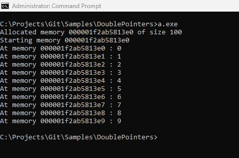

# Program to demostrate allocation of n number of bytes and assigning first 10 bytes from 0 to 9.

## alloc_mem
### description: allocated memory of size_mem bytes and stores in *myptr.
### params:
###       size_mem: interger value, number of bytes to be allocated.
###       myptr: double pointer, store the allocated memory in zero index.
### return:
###       nothing.

            
## Output

